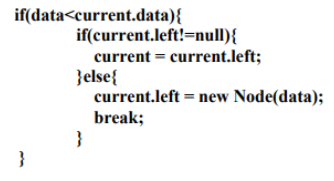

## 13.2.2 Pertanyaan Percobaan
1. Mengapa dalam binary search tree proses pencarian data bisa lebih efektif dilakukan dibanding
binary tree biasa?
    * Jawaban : karena terdapat 2 step saja untuk melakukan search yaitu mencari dengan menggunakan node nilai lebih kecil dan node lebih besar dengan begitu mudah
2. Untuk apakah di class Node, kegunaan dari atribut left dan right?
    * Jawaban : Berfungsi untuk menghubungkan node satu dengan yang lain dan utnuk menyimpan datanya
3. a. Untuk apakah kegunaan dari atribut root di dalam class BinaryTree?
    * Jawaban : sebagai penanda data sebagai current

    b. Ketika objek tree pertama kali dibuat, apakah nilai dari root?
    * Jawaban : Nilai root untuk pertama kali Ketika dibuat adalah null
4. Ketika tree masih kosong, dan akan ditambahkan sebuah node baru, proses apa yang akan terjadi?
    * Jawaban : Sebelum menambahkan dilakukan pengecekan apakah terdapat isinya atau masih kosong Jika data kosong data yang di tambahkan akan mejadi Node current dan berguna sebagai root
5. Perhatikan method add(), di dalamnya terdapat baris program seperti di bawah ini. Jelaskan secara
detil untuk apa baris program tersebut?

    

    * Jawaban : Pertamakali melakukan pengecekan apakah data kurang dari current.data lalu jika true akandilakukan pengecekan lagi untuk atribut left tidak sama dengan null makan data yang ada akan menjadi left

## 13.3.2 Pertanyaan Percobaan
1. Apakah kegunaan dari atribut data dan idxLast yang ada di class BinaryTreeArray?
    * Jawaban : berguna untuk menyimpan data ke array jika idxlast untuk menentukan banyaknya nlai yang ada pada array tersebut.
2. Apakah kegunaan dari method populateData()?
    * Jawaban : Berfungsi untuk menujukkan data pada idxLast
3. Apakah kegunaan dari method traverseInOrder()?
    * Jawaban : Berfungsi untuk menentukan root awal
4. Jika suatu node binary tree disimpan dalam array indeks 2, maka di indeks berapakah posisi left child
dan rigth child masin-masing?
    * Jawaban : : Posisi left child berada pada indeks ke 1 dan right child berada pada indeks ke 2
5. Apa kegunaan statement int idxLast = 6 pada praktikum 2 percobaan nomor 4  ?
    * Jawaban : : Membuat indeks terakhir di array ke 6

