## 16.2.3. Pertanyaan Percobaan
1. Perhatikan baris kode 25-36, mengapa semua jenis data bisa ditampung ke dalam sebuah Arraylist?
*  Jawab : Karena variabel l sebagai Object dari List tidak mendefinisikan type datanya. Sehingga, object l
dapat menampung tipe data generic atau semua tipe data.
2. Modifikasi baris kode 25-36 seingga data yang ditampung hanya satu jenis atau spesifik tipe tertentu! 
* 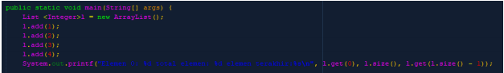
Hasil run setelah di modif 
* 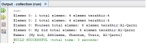
3. Ubah kode pada baris kode 38 menjadi seperti ini
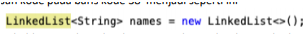
* jawab 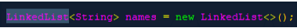
4. Tambahkan juga baris berikut ini, untuk memberikan perbedaan dari tampilan yang sebelumnya 
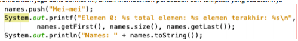
* jawab 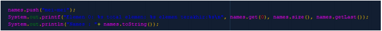
5. Dari penambahan kode tersebut, silakan dijalankan dan apakah yang dapat Anda jelaskan!
* Jawab : Perbedaan antara menggunakan List dan LinkedList adalah ketika menggunakan List kita tidak
bisa menggunakan fungsi-fungsi yang ada pada LinkedList. Namun, ketika kita menggunakan LinkedList
kita masih tetap bisa menggunakan fungsi yang ada pada List. Hal ini dikarenakan LinkedList mempunyai
parent (extends) List. Sehingga LinkedList masih sama dengan method yang ada pada List

## 16.3.3. Pertanyaan Percobaan
1. Apakah perbedaan fungsi push() dan add() pada objek fruits?
* Jawab : Fungsi add() adalah fungsi dari interface Class Stack yaitu Class List. push adalah fungsi asli dari
Class Stack itu sendiri. Jadi, ketika kita menggunakan Stack lebih baik menggunakan push, supaya kita
atau programmer lain tahu bahwa kita menggunakan Stack Collection. Untuk fungsi, keduanya berfungsi
sama, yaitu menambahkan data pada List
2. Silakan hilangkan baris 43 dan 44, apakah yang akan terjadi? Mengapa bisa demikian? 

jawab 
* 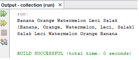

Yang terjadi adalah data yang di-retrieve kosong. Karena, pada kode sebelumnya terdapat sebuah
perulangan yang menggunakan fungsi pop (untuk mengeluarkan data paling atas dari Stack) hingga data
sampai kosong.
3. Jelaskan fungsi dari baris 46-49?
* Jawab : menggunakan Iterator.

➢ Iterator adalah sebuah object yang bisa digunakan untuk looping dalam collections, seperti
ArrayList, Stack, dll.

➢ Dalam baris tersebut menggunakan for yang dimulai pada data yang dihasilkan dari Iterator it =
fruits.iterator(); sampai dengan batas it.hasNext();

➢ Kemudian dalam perulangan tersebut dideklarasikan sebuah variabel fruit bertipe data String
yang memiliki nilai hasil dari it.next();

➢ Kemudian, variabel fruit tersebut dicetak pada baris kode System.out.printf("%s ", fruit);

➢ Perulangan ini akan berhenti sampai it.hasNext() me-return data false
4. Silakan ganti baris kode 25, Stack menjadi List dan apakah yang terjadi? Mengapa bisa demikian? 
* 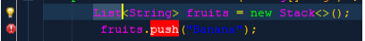
    Akan terjadi error pada baris yang menggunakan fungsi dari Class Stack. Dikarenakan List tidak mengextends pada Stack atau meng - implement Stack. Sehingga Class List tidak bisa menggunakan fungsiyang ada pada Class Stack.
5. Ganti elemen terakhir dari dari objek fruits menjadi “Strawberry”!
    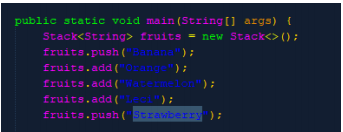

    Hasil run 

    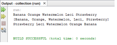

## 16.4.3. Pertanyaan Percobaan
1. Pada fungsi tambah() yang menggunakan unlimited argument itu menggunakan konsep apa? Dan
kelebihannya apa?
* Jawab : Menggunakan konsep Variable Arguments. Mempunyai kelebihan dapat menambahkan data
pada parameter lebih dari satu
2. Pada fungsi linearSearch() di atas, silakan diganti dengan fungsi binarySearch() dari collection!

     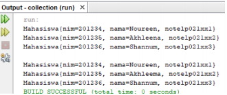
3. Tambahkan fungsi sorting baik secara ascending ataupun descending pada class tersebut!
 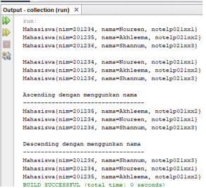

