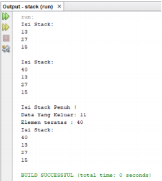
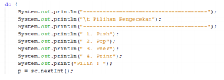

## 7.2.3 Pertanyaan
1. Perhatikan class StackMain, apakah fungsi angka 5 pada potongan kode program berikut?
* Fungsi angka 5 pada gambar tersebut adalah sebagai parameter batas maksimal isian data pada
objek stk adalah 5
2. Lakukan penambahan data ke stack sebanyak dua kali, menggunakan angka 18 dan 40. Tampilkan
hasilnya! 
* 
3. Pada soal nomor 2, mengapa data yang dimasukkan ke dalam Stack hanya angka 18, sedangkan
angka 40 tidak dimasukkan? Jelaskan! 
* 
## 7.3.3 Pertanyaan
1. Perhatikan class StackMain, pada saat memanggil fungsi push, parameter yang dikirimkan adalah
bk. Data apa yang tersimpan pada variabel bk tersebut?

    

    * Data yang tersimpan dalam parameter tersebut adalah data buku(judul, nama, pengarang,
tahun terbit , jumlh halaman dan harga)
2. Tunjukkan potongan kode program untuk menentukan kapasitas penampungan stack!

3. Apakah fungsi penggunaan do-while yang terdapat pada class StackMain?
    * Digunakan sebagai looping untuk proses memasukan data oleh user. Apabila pengisian data
sudah terpenuhi maka aka nada pertanyaan apakah user ingin memasukan data baru atau
tidak?
4. Modifikasi kode program pada class StackMain sehingga pengguna dapat memilih operasi
operasi pada stack (push, pop, peek, atau print) melalui pilihan menu program

## 7.4.3 Pertanyaan
1. Perhatikan class Postfix, jelaskan alur kerja method derajat!
2. Apa fungsi kode program berikut?
    * Mempuyai fungsi sebagai menyimpan dan mengambil data yang berupa String
3. Jalankan kembali program tersebut, masukkan ekspresi 3*5^(8-6)%3. Tampilkan hasilnya! 
4. Pada soal nomor 2, mengapa tanda kurung tidak ditampilkan pada hasil konversi? Jelaskan!
